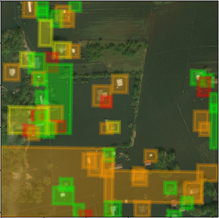

<br/>
<div id="logo" align="center">
    <h1>aquila</h1>
    <p>Assess building damage from satellite images.</p>
</div>

<div style='margin:0 auto;width:80%;' align='center'>



</div>

## Table of Contents

-   [How it works](#how-it-works)
-   [Getting Started](#getting-started)
    -   [Prerequisites](#prerequisites)
    -   [Initial setup](#initial-setup)
    -   [Downloading theia](#downloading-theia)
    -   [Running the CLI](#running-the-cli)
-   [Contributing](#contributing)
-   [Versioning](#versioning)
-   [Authors](#authors)
-   [License](#license)
-   [Acknowledgments](#acknowledgments)

## How it works

Aquila is a data pipeline for damage assessment after natural catastrophes.


The pipeline consists of following elements:

1. Images of the xBD dataset are loaded from disk.
2. [theia](theia/) processes the image and outputs segmentation maps indicating
   building locations.
3. [inundatio](inundatio/) cuts out buildings based on the segmentation map
   obtained in the previous step using the flood-fill algorithm.
4. [perses](perses/) assesses the damage of each building.

Segmentation maps obtained from theia can be tiled. This allows for damage
assessment across greater geographical areas.

## Getting Started

These instructions will get you a copy of the project up and running on your
local machine for development and testing purposes.

### Prerequisites

You will need python3 and pip3 installed on your machine. You can install it
from the official website [https://www.python.org/](https://www.python.org/).

To install pytorch with CUDA support, conda is recommended. An installation
guide is available in the conda docs:
[https://docs.conda.io/projects/conda/en/latest/user-guide/install/](https://docs.conda.io/projects/conda/en/latest/user-guide/install/).

To be able to view und run the example notebooks on your machine, jupyter is
required. An installation guide can be found on their website:
[https://jupyter.org/install](https://jupyter.org/install).

### Initial setup

A step by step series of examples that tell you how to get the project up and
running.

Clone the git repository

```bash
git clone https://github.com/intelligenerator/aquila.git
cd aquila/
git submodule init
git config submodule.recurse true
git submodule update --init --recursive
```

Next, installed the required packages. This may vary based on your system
hardware and requirements. Read more about pytorch installation:
[https://pytorch.org/get-started/locally/](https://pytorch.org/get-started/locally/)

```bash
conda create --name torch
conda activate torch
conda install pytorch torchvision cudatoolkit=10.2 matplotlib scikit-learn -c pytorch
```

To exit the virtual environment run

```bash
conda deactivate
```

Happy coding!

### Downloading theia

You will probably want to download a set of pretrained weights for theia, the
building segmentation network, to just try aquila and save some training time.

Download `theia.pth` from Google Drive and place this file in `theia/model`:
[https://drive.google.com/file/d/1qmKnqw9s5oAXDWJHxEhVID48KNTxbLM\_/view?usp=sharing](https://drive.google.com/file/d/1qmKnqw9s5oAXDWJHxEhVID48KNTxbLM_/view?usp=sharing)

### Running the CLI

To run the aquila cli, make sure you followed the installation steps listed
above.

First, activate the conda `torch` environment created above.

Next, you may invoke the cli. You can use some example images from the xBD
dataset provided in the `images/` folder, or use your own images.

To see the available options, run:

```bash
python aquila.py -h
```

To assess building damage on an example image, run:

```bash
python aquila.py images/hurricane_florence_2_pre_disaster.png images/hurricane_florence_2_post_disaster.png
```

## Contributing

Please read [CONTRIBUTING.md](CONTRIBUTING.md) and
[CODE_OF_CONDUCT.md](CODE_OF_CONDUCT.md) for details on our code of conduct, and
the process for submitting pull requests to us.

## Versioning

We use [SemVer](http://semver.org/) for versioning. For the versions available,
see the [tags on this repository](https://github.com/intelligenerator/theia/tags).

## Authors

The Intelligenerator Group - [intelligenerator](https://github.com/intelligenerator)

See also the list of
[contributors](https://github.com/intelligenerator/aquila/contributors)
who participated in this project.

## License

This project is licensed under the MIT License - see the
[LICENSE.md](LICENSE.md) file for details.

## Acknowledgments

-   [github python gitignore template](https://github.com/github/gitignore/blob/master/Python.gitignore) - The gitignore template
-   [python3 tutorial](https://docs.python.org/3/tutorial/venv.html) - Guide and
    explanations
-   [Contributor Covenant](https://www.contributor-covenant.org/) - Code of Conduct
